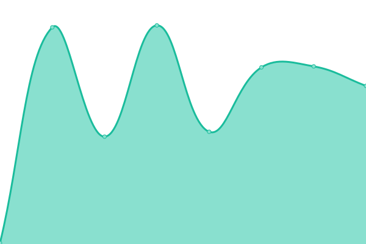
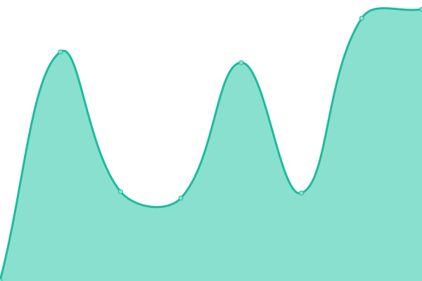

# [ParseJet](https://parsejet.com) Status

Uptime monitor and status page for [ParseJet](https://parsejet.com) — the universal file and URL parsing API. Extract text from PDF, YouTube, web pages, and 25+ formats with one API.

<!--start: status pages-->
<!-- This summary is generated by Upptime (https://github.com/upptime/upptime) -->
<!-- Do not edit this manually, your changes will be overwritten -->
<!-- prettier-ignore -->
| URL | Status | History | Response Time | Uptime |
| --- | ------ | ------- | ------------- | ------ |
|  [Website](https://parsejet.com) | 🟩 Up | [website.yml](https://github.com/yooumuu/parsejet-status/commits/HEAD/history/website.yml) | 

 144ms
     
 | 

<a href="https://status.parsejet.com/history/website">100.00%</a>
    

|  [API](https://api.parsejet.com/api/health) | 🟩 Up | [api.yml](https://github.com/yooumuu/parsejet-status/commits/HEAD/history/api.yml) | 

 847ms
     
 | 

<a href="https://status.parsejet.com/history/api">100.00%</a>
    

|  [Parse (URL)](https://api.parsejet.com/v1/parse/auto/url) | 🟩 Up | [parse-url.yml](https://github.com/yooumuu/parsejet-status/commits/HEAD/history/parse-url.yml) | 

 589ms
     
 | 

<a href="https://status.parsejet.com/history/parse-url">100.00%</a>
    

<!--end: status pages-->

## Links

- [ParseJet](https://parsejet.com) — Official website
- [Documentation](https://parsejet.com/docs) — API reference and guides
- [Pricing](https://parsejet.com/pricing) — Free tier with 300 credits/month
- [TypeScript SDK](https://www.npmjs.com/package/parsejet) — `npm install parsejet`
- [MCP Server](https://www.npmjs.com/package/@parsejet/mcp-server) — Use ParseJet in Claude Code & Cursor

## About

This status page is powered by [Upptime](https://github.com/upptime/upptime). Checks run every 5 minutes via GitHub Actions.

## License

- Code: [MIT](./LICENSE)
- Data in `./history`: [Open Database License](https://opendatacommons.org/licenses/odbl/1-0/)
